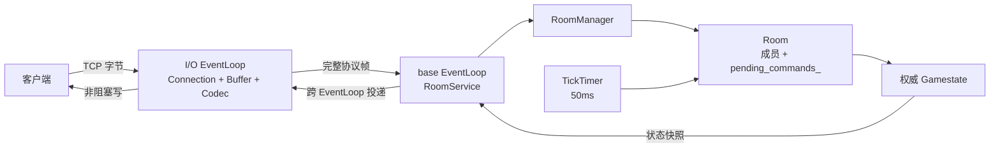

# L-W — C++17 Reactor 实时房间服务器


L-W 是一个运行在 Linux 上的单机实时多人房间服务器。项目基于 TCP 二进制协议、非阻塞 I/O、`epoll ET`、`eventfd` 和 one-loop-per-thread 模型，实现了从网络收发、房间业务、权威 Tick 到重连、背压、持久化和压测诊断的完整工程链。

[架构设计](docs/architecture.md) · [协议说明](docs/protocol.md) · [测试体系](docs/testing.md) · [性能报告](docs/performance.md)

## 项目亮点

- **Reactor 网络层**：非阻塞 socket、`epoll ET`、按需 `EPOLLOUT`、部分读写和 `eventfd` 跨线程唤醒。
- **线程所有权**：每个 `Connection` 的 socket 与读写缓冲只由所属 I/O EventLoop 操作；房间与权威状态由 base EventLoop 串行维护。
- **二进制协议**：增量 Codec 支持半包、粘包、多帧与非法长度检查，业务协议使用网络字节序。
- **权威房间状态**：固定 50ms Tick 批量处理玩家命令，生成带 `tick_id` 的状态快照。
- **连接韧性**：心跳超时、token 重连、旧连接失效检查、慢连接隔离与写缓冲背压。
- **持久化与关闭**：周期检查点、启动恢复、损坏数据拒绝、`signalfd` 驱动的优雅关闭和最终落盘。
- **工程化压测**：独立单线程 epoll LoadGen，记录连接、JOIN、MOVE、快照、心跳延迟、调度延迟和第一次失败上下文。

## 实验结果

2026-08-26，在服务器和 LoadGen 位于同一台 4 vCPU Linux 虚拟机、通过 `127.0.0.1` 通信的条件下，完成了一次 4600 客户端完整工作负载：

| 指标 | 结果 |
| --- | ---: |
| 客户端 / 房间 | 4600 / 1150 |
| 连接成功 / JOIN 成功 | 4600 / 4600 |
| MOVE 吞吐 | 46,001 帧/秒 |
| 快照接收吞吐 | 91,999 帧/秒 |
| 心跳 RTT p99 | 26.390 ms |
| 快照间隔 p99 | 75.557 ms |
| LoadGen 调度延迟 p99 | 3.112 ms |
| 协议错误 / 意外断开 / Tick 缺口 | 0 / 0 / 0 |

这是固定环境下的一次成功观测，不代表生产环境容量或稳定最大在线人数。完整负载、原始计数和限制见 [4600 客户端实验记录](docs/results/2026-08-26-single-vm-4600.md)。

## 核心架构



核心约束：

1. socket、`read_buffer_`、`write_buffer_` 和连接 I/O 生命周期属于对应 I/O EventLoop。
2. `RoomService`、`RoomManager`、`Room`、`SessionManager` 和权威游戏状态属于 base EventLoop。
3. 跨线程只传递任务和稳定数据，不跨线程直接修改对方拥有的状态。
4. `Session` 保存可恢复的玩家身份；`Connection` 只代表一次 TCP 传输关系，旧连接的缓冲和写债务不会迁移到新连接。

## 主要能力

### 网络与协议

- 非阻塞 TCP 长连接和半关闭处理
- `epoll ET` 事件循环与 `eventfd` 唤醒
- EventLoopThreadPool 和 one-loop-per-thread
- 二进制帧、半包、粘包、多帧和异常帧处理
- JOIN、LEAVE、CHAT、MOVE、ATTACK、HEARTBEAT、RESUME

### 房间与状态

- 固定容量房间和状态机
- 玩家稳定身份与成员关系
- 每名玩家每个 Tick 最多提交一条命令
- 权威移动、攻击、生命值与状态快照
- 50ms Tick 和累计 `timerfd` expiration 处理

### 可靠性

- 合法入站活动刷新与心跳超时
- token 重连和重连窗口
- 写缓冲预留、快照丢弃和关键消息关闭策略
- 周期检查点、原子替换、启动恢复和损坏检查点拒绝
- SIGINT / SIGTERM 优雅关闭

## 构建与运行

环境要求：

- Linux
- 支持 C++17 的 `g++`
- GNU Make
- pthread

```bash
make
make run
```

服务器默认监听 `8080` 端口。运行时文件位于：

```text
data/server.checkpoint
logs/server.log
```

`data/`、`logs/`、`build/` 和压测原始结果不进入 Git。

## 测试

运行全部自包含回归测试：

```bash
make test-all
```

运行 LoadGen 失败路径专项测试：

```bash
make test-load-gen-failure
```

测试覆盖 Buffer、EventLoop、线程池、TcpServer、Codec、协议、房间状态、Tick、重连、背压、持久化、连接关闭通知及 LoadGen 失败报告。

ASan/UBSan、TSan、真实入口、信号关闭与检查点恢复采用独立验收流程，详见 [测试体系](docs/testing.md)。

## 压测工具

```bash
make load-checkpoint-generator load-gen
```

LoadGen 是独立 TCP 客户端进程，只能观察协议层结果，不能直接读取服务器内部的 Room、Tick 或任务队列。

工具说明与报告字段见 [benchmarks/README.md](benchmarks/README.md)。

## 目录结构

```text
.
├── main/          # 服务器入口与生命周期编排
├── include/       # 模块接口
├── src/           # Reactor、协议、房间、会话和持久化实现
├── tests/         # 单元、集成、异常与生命周期测试
├── benchmarks/    # LoadGen、检查点生成器和慢读场景
├── docs/          # 架构、协议、测试和性能文档
└── Makefile       # 构建与测试入口
```

## 项目边界

当前项目聚焦单机 Reactor 实时房间服务器，不包含数据库集群、服务发现、跨服匹配、分布式事务或生产部署系统。

压测数字只在明确的代码版本、硬件、进程部署和负载模型下成立。
