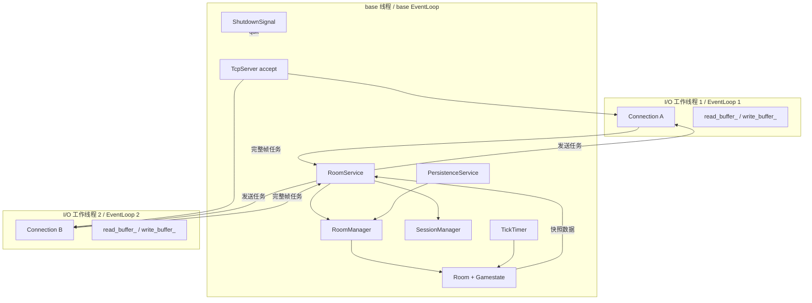

# 架构设计

## 1. 目标与边界

L-W 使用 C++17 在 Linux 上实现单机实时房间服务器。

系统将网络 I/O 与业务状态分离：I/O EventLoop 负责连接传输，base EventLoop 负责房间、会话和权威状态，从线程所有权上减少共享可变状态。

该架构解决以下问题：

- 大量长连接的非阻塞读写；
- TCP 半包、粘包和多帧解析；
- I/O 线程与房间线程之间的安全任务投递；
- 固定 Tick 下的权威状态更新；
- 断线重连、慢连接和写缓冲压力；
- 崩溃后的检查点恢复与进程优雅关闭。

## 2. 线程模型



## 3. 对象与线程职责

| 对象 | 主要责任 | 所属线程 |
| --- | --- | --- |
| `TcpServer` | 监听、accept、分配 I/O EventLoop、管理连接表 | base 线程 |
| `Connection` | socket、非阻塞收发、读写缓冲、背压计数 | 所属 I/O 工作线程 |
| `Buffer` / `Codec` | 字节累积、完整帧拆分、半包保留 | 调用它们的 I/O 工作线程 |
| `RoomService` | 协议帧与房间/会话业务之间的边界 | base 线程 |
| `RoomManager` | 房间注册、玩家路由、稳定身份映射 | base 线程 |
| `Room` | 成员、状态机、待处理命令和权威状态 | base 线程 |
| `SessionManager` | token、在线/离线状态、重连窗口 | base 线程 |
| `TickTimer` | 通过 `timerfd` 周期唤醒 Tick | base 线程 |
| `PersistenceService` | 周期保存、启动恢复、最终落盘 | base 线程 |
| `ShutdownSignal` | `signalfd` 接收关闭信号并触发退出 | base 线程 |

## 4. 请求执行链

以客户端 A 发送 MOVE 为例：

1. EventLoop 1 收到 socket 可读事件，`Connection A` 循环读取字节到 `read_buffer_`。
2. `Codec::decode()` 只消费完整帧，半帧继续留在 Buffer 中等待下一次读取。
3. 完整帧通过消息回调进入 `RoomService`；涉及房间状态的工作被安排到 base EventLoop。
4. `RoomService` 解码 MOVE 负载，`RoomManager` 根据稳定玩家身份定位 `Room`。
5. `Room` 检查房间状态、玩家状态及“一名玩家每 Tick 一条命令”约束。
6. 合法命令被写入 `pending_commands_`，但不会立即修改权威位置。

关键不变量：

> I/O 工作线程不能直接修改 Room，base 线程也不能直接操作其他 EventLoop 所属连接的 socket 和缓冲。

## 5. Tick 与快照链

1. base EventLoop 中的 `TickTimer` 每 50ms 产生一次到期事件。
2. `Room` 将当前命令批次与下一批命令分离，保证本轮处理集合稳定。
3. `Gamestate` 按业务规则应用 MOVE 和 ATTACK。
4. Tick 完成后递增 `tick_id`。
5. `Room` 生成该 Tick 完成后的权威快照。
6. `RoomService` 编码 `state_snapshot`。
7. 发送任务被投递到每个 `Connection` 所属的 I/O EventLoop。
8. `Connection` 在自己的 I/O 工作线程中处理 `write_buffer_` 和按需 `EPOLLOUT`。

命令到达 base EventLoop 的时刻决定它能否进入当前 Tick。

尚未执行的跨线程任务不能被视为已经进入 `pending_commands_`。

## 6. Connection 与 Session

`Connection` 和 `Session` 表达不同生命周期：

- `Connection` 代表一次 TCP 连接，拥有 fd、I/O 状态、读写缓冲和当前写债务。
- `Session` 代表可恢复的玩家身份，保存 token、player_id、room_id 和离线期限。

连接断开后：

1. `TcpServer` 保证业务关闭通知最多触发一次。
2. base EventLoop 将 Session 标记为离线。
3. 重连窗口内继续保留玩家身份和房间关系。
4. 新的 `Connection B` 携带 token 发送 RESUME。
5. token 有效、Session 未过期且未在线时，Session 绑定到 `Connection B`。
6. 旧 `Connection A` 的 Buffer、fd 和写缓冲债务不会迁移。

这种设计避免旧连接的延迟关闭回调破坏新连接绑定，也避免传输层状态污染业务身份。

## 7. 背压策略

`Connection` 对待发送字节进行容量预留并维护待写字节数：

- 普通部分写入保留在 `write_buffer_`，等待下一次 `EPOLLOUT`。
- 高频、可替代的状态快照可以在压力下丢弃。
- JOIN、LEAVE、错误响应等关键消息无法安全排队时关闭该慢连接。
- 一个慢客户端只影响自己的 Connection，不阻塞其他连接和房间 Tick。

该策略选择保护服务整体稳定性，而不是为单个长期不读数据的客户端无限占用内存。

## 8. 持久化与关闭

检查点只保存可以跨进程恢复的业务状态，不保存：

- fd；
- EventLoop；
- Connection；
- socket Buffer；
- 回调对象；
- 未完成的运行时 I/O 状态。

正常关闭链：

```text
SIGINT / SIGTERM
  -> signalfd 可读
  -> base EventLoop 回调
  -> base_loop.quit()
  -> 停止超时定时器和 TickTimer
  -> PersistenceService 最终保存
  -> 停止持久化服务和 ShutdownSignal
  -> 刷新日志并退出
```

启动时：

- 检查点不存在：创建默认房间；
- 检查点合法：恢复业务状态；
- 检查点损坏或无法恢复：拒绝带病启动。

## 9. 核心设计取舍

- 使用 base EventLoop 串行维护房间状态，减少 Room 内部锁和并发状态组合。
- 使用多个 I/O EventLoop 分担连接收发，但不让 I/O 线程越过业务所有权边界。
- 使用 Session 分离业务身份与 TCP 连接，使重连不会复用旧传输状态。
- 使用固定 Tick 结算而不是请求到达即修改状态，获得统一的权威时间边界。
- 使用有界背压而不是无限写缓冲，明确慢客户端的资源边界。
